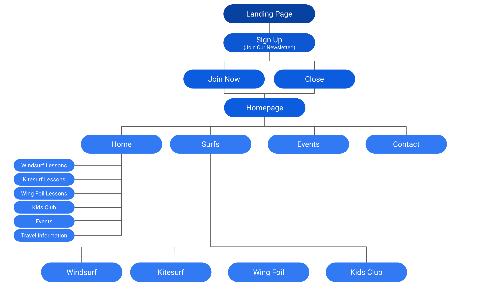

Github-pages: URL:
        https://sinemyildiz314.github.io/bestwavessurfingclub.com/

Github-repo: URL:
        https://github.com/sinemyildiz314/bestwavessurfingclub.com

# 1. Planning Analysis Sheet

## 1. Website Name: Best Waves Surfing Club (BWSC)
## 2. Website Purpose: 
* Provide information about BWSC and its services (surf lessons, kids club, etc.)
* Promote events and encourage community engagement
* Capture leads through newsletter signup
*Provide travel information for visitors
## 3. Target Audience:
* Surfing enthusiasts (beginner to advanced)
* Families with children interested in surfing
* People looking for an active vacation or experience
## 4. Website Content:
| Page | Content | Purpose |
|---|---|---| 
| index.html (Home) | Welcome message, overview of services, newsletter signup, image gallery with links to other pages | Introduce BWSC, highlight key offerings, capture leads, and direct users to other relevant pages. |
| surfs.html | Overview of surf types offered (with links to sub-pages) | Provide a clear overview of the different types of surfing lessons and experiences offered. |
| windsurf.html | Details about windsurfing lessons, including pricing and skill levels. | Provide specific information about windsurfing lessons to potential customers. | 
| kitesurf.html | Details about kitesurfing lessons, equipment (Duotone Kiteboarding), including pricing, skill levels, etc. | Provide specific information about kitesurfing lessons, highlighting the use of high-quality equipment. |
| wingfoil.html | Details about wing foiling lessons | Provide specific information about wing foiling lessons, including pricing, skill levels. |
| kidsclub.html | Information about the Kids Club, activities, age groups, pricing, etc. | Provide comprehensive information about the Kids Club to parents and guardians. |
| events.html | Event calendar, descriptions of upcoming events, photo galleries from past events | Keep visitors informed about events and promote community engagement. |
| contact.html | Contact information, location map, travel information | Provide various ways for visitors to contact BWSC and offer essential travel information. |

## 5. Website Design:
* Layout: Clean and modern design with a focus on visual appeal. Use of high-quality images and a video to showcase surfing experience in Alacati.
* Navigation:
        - Clear and intuitive navigation menu with a hamburger menu for mobile responsiveness.
        - Sub-menus for different surf types under the "Surfs" section.
        - Links within the image gallery to relevant pages.
* Color Scheme: Use colors that evoke the ocean, beach, and surfing lifestyle (blues, greens, whites, sandy tones). While testing its color contrast for accessibility and color blindness etc.
* Typography: Choose fonts that are easy to read and reflect the brand's personality.
* Mobile Responsiveness: Ensure the website is fully responsive and functions well on all devices (smartphones, tablets, desktops).
* Accessibility: Make sure the website is reaching accessibility standards by using symentic HTML and ARIA across its design. Such as when adding images, forms, CTA buttons etc.  

## 6. Functionality:
 *    Newsletter Signup: A pop-up form to capture leads (name, surname, email, comment).
    - Image Gallery: Visually engaging gallery with high-quality images and links to relevant pages.
    - Contact Form: Implemented a contact options on the contact.html page, providing users with the following options:
       - Direct Email: Clicking the "Email Me" link opens the user's default email client.
       - Phone Call: A clickable phone number link allows users to initiate a call directly from the page.
       - WhatsApp: A WhatsApp contact button is available on all pages for instant messaging."

# 2. Site Map
## Visual Diagram inside ./images/
    * sitemap.png

## Text-based (including sitemap.xml)
        * created sitemap.xml file and added in the project folder.
## Loom video: overview of the product (website) created
        * TBD

# 3. Wireframe

        * Created wireframe for a sample page of my site (i.e.homepage).

.png)

# 4. Resources

* Development:
   - UCD Course Materials: slides, class practices, and live examples.
   - edureka.co: git tutorials.
   - MND: play, examine and research certain functions about html & css
   - AI tools: Gemini, ChatGPT to look up one liner codes and different styling ideas.
   - codepen.io: sectional code trials
   - color design: color.adobe.com, webdevfooundations.net/color, and chrome dev tool.
   - w3schools.com
   - Google dev tools
   - Add: SITE FUNCTIONS AND how and what I designed, transition, YouTube video, email, call, location links, clickable pages...
   - Sitemap: homepage has clickable images, added as a map...
* SEO:
  - Linking: text navigation hyperlinks, verified fuctionality of all hyperlinks 
  - Page Layout: used css for page layout
  - Images & Multimedia: configured meaningful alternate texts, taking into account search engine robots accessibility to the texts abd hyperlinks contained within multimedia
  - Google's HTTPS Protocol: Applied on the site 
  - Robots.txt file added

* Testing Tools:
  - diffchecker.com
  - css validator
  - html validator
  - Rendering: Chrome, Edge, and Firefox 

* Publish:
  - VS Code: git linked and pushed to GitHub for hosting
  - stored files locally on developer's computer and hosted extarnally as a github.io page. 

# 5. Further Improvements
* Due to time constraints, these are the remaining developments on the site which I will be applying. For any further advice please email: sinemyildiz314@gmail.com.
* Hamburger styling: adding sub-menu arr

